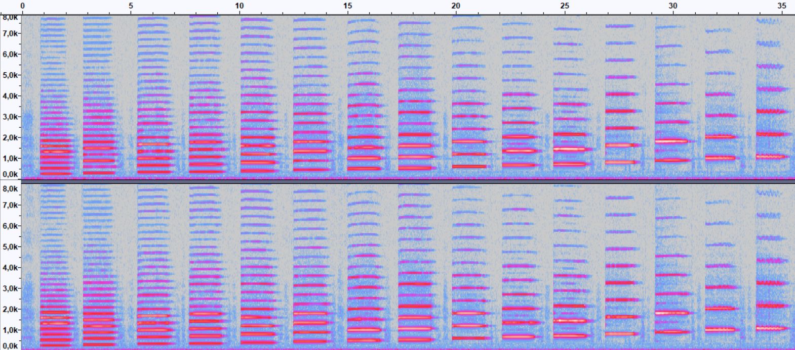
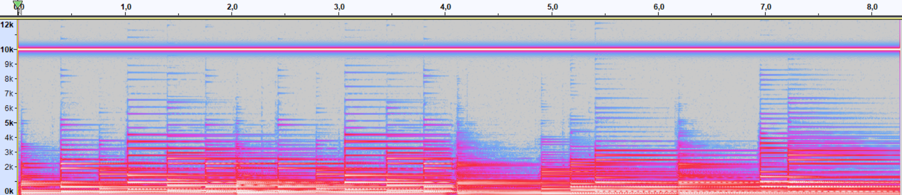

<h1 style="text-align: center;">

Jakub Ostrzołek

WMM - lab. 2 - Dźwięk

</h1>

## Zadanie 1.1
1. Wpływ rozmiaru okna na widmo
    * rozmiar okna: 512  
      
    * rozmiar okna: 1024 (domyślne)  
      
    * rozmiar okna: 2048  
      

    Im większe okno, tym precyzyjniej wyznaczana jest częstotliwość sygnału wejściowego.
2. Wpływ rodzaju okna na widmo
    * okno prostokątne (brak okna)  
      
    * okno Welcha  
      
    * okno Bartletta  
      
    * okno Hanna (domyślne)  
      
    * okno Blackmana  
      
    * okno Gaussa (a=4.5)  
      
    * okno Blackmana-Harrisa  
      

    Różne okna w różny sposób przedstawiają widmo. Wszystkie osiągają swoje szczyty w okolicach 1000 Hz, ale różnią się poziomem "rozlewania" się na nieporządane częstotliwości. Najmniej zaburzeń wprowadza okno Blackmana-Harrisa, a najwięcej okno prostokątne.
3. Spektrogram
    * 1000 Hz  
      

      Tak jak można się było spodziewać po sztucznie wygenerowanym tonie, spektrogram posiada jeden prążek w okolicach 1000 Hz i jest niezmienny w czasie. Oprócz tego, na samym początku i końcu spektrogramu widać przez ok. 10 ms szerokopasmowy szum:  
      

      Szum występuje, ponieważ okna na początku i końcu spektrogramu wychodzą poza wygenerowany ton (gdzie pradopodobnie przyjmuje się wartość sygnału 0 dla wszystkich próbek). W takiej sytuacji widmo musi się "rozlać", aby przybliżyć sytuację całkowitej ciszy w jednej części okna i jakiegoś tonu w pozostałej części okna. 

    * 1000 Hz + 2000 Hz  
      
    
      Tym razem spektrogram posiada 2 prążki - jeden w okoliach 1000 Hz, a drugi 2000 Hz. Szerokopasmowy szum na krańcach również występuje w tej sytuacji.

## Zadanie 1.2
### Flet

Dźwięk ma częstotliwość ok. 440 Hz, co odpowiada dźwiękowi $A_4$ (w polskich oznaczeniach $a^1$). Widoczne piki w wyższych częstotliwościach odpowiadają składowym harmonicznym tego dźwięku, a niższy ton ma ok. 50 Hz i prawdopodobnie pochodzi z zakłóceń elektromagnetycznych (standardowo w gniazdkach jest 50 Hz).

Dla każdego dźwięku widać serię prążków zaczynających się dla 440 Hz i odległych od siebie również o 440 Hz. Najniższy prążek jest najszerszy, a wyższe coraz bardziej zanikają.

Głośniejszym dźwiękom granym przez flecistkę odpowiadają szersze prążki oraz pojawiają się nowe prążki powyżej dotychczasowych. 

### Obój
Piano  

Forte  

Dla instrumentu grającego głośno widać na spektrogramie dużo więcej składowych harmonicznych dla każdego dźwięku, niż dla instrumentu grającego cicho.

### Waltornia

W skali logarytmicznej częstotliwość prążków na spektrogramie intuicyjnie odpowiada wysokości dźwięku. Jest tak dlatego, że człowiek jako interwały muzyczne rozpoznaje stosunki częstotliwości, a nie ich różnice (np. oktawa zawsze odpowiada stosunkowi częstotliwości równemu 2).

Skala logarytmiczna spektrogramu pozwala łatwiej analizować melodię niż w przypadku spektrogramów liniowych, widocznych przy analizie dźwięku z oboju.

## Zadanie 1.3
Głos mężczyzny  

Głos kobiety  

Głos mężczyzny ma bardziej wypełnione zakresy częstotliwości od ok. 130 Hz do 220 Hz w porównaniu do głosu kobiety.

Oprócz tego u kobiety widać większe nagromadzenia energii w okolicach częstotliwości 5,5 kHz i 8 kHz, a u mężczyzny w okolicach częstotliwości 3 kHz.

## Zadanie 2.1
### Filtr górnoprzepustowy
Głos mężczyzny  

Głos kobiety  

Głos kobiety po filtrowaniu górnoprzepustowym zmienił się praktycznie niezauważalnie dla mojego ucha. Z widma zniknął jedynie pik w okolicach 1 Hz, który prawdopodobnie i tak nie pochodził bezpośrednio z głosu kobiety, ale pik odpowiadający tonowi podstawowemu głosu został prawie nieruszony.

Głos mężczyzny po filtrowaniu górnoprzepustowym stracił swoją głębokość i ciepłą barwę, brzmi bardziej "telefonicznie". Na widmie widać, że zniknął pik przy 130 Hz, odpowiadający tonowi podstawowemu.

### Filtr dolnoprzepustowy
* 10000 Hz - mowa nadal jest wyrazista
* 8000 Hz - mowa przestaje być wyrazista
* 3000 Hz - mowa nieprzyjemna do słuchania, ale wciąż zrozumiała
* 800 Hz - mowa ciężka do zrozumienia
* 400 Hz - ok. połowa słów niemożliwa do zrozumienia
* 300 Hz - większość słów niezrozumiała

## Zadanie 2.2
### Trzaski
* rozmiar okna: 256  

* rozmiar okna: 512  

* rozmiar okna: 1024  

* rozmiar okna: 2048  

* rozmiar okna: 4096  

Im mniejszy rozmiar okna tym większa precyzja w dziedzinie czasu a mniejsza w dziedzinie częstotliwości.

Im większy rozmiar okna tym mniejsza precyzja w dziedzinie czasu a większa w dziedzinie częstotliwości.

### Usuwanie trzasków
Trzaski usuwałem na rozmiarze okna 128. Oto wynik na spektrogramie:  

Nadal widać jedno zakłócenie na spektrogramie, jednak z jakiegoś powodu nie potrafiłem go usunąć (zawsze po usunięciu pojawiał się na nowo). Nie słychać tego zakłócenia przy odtwarzaniu.

### Pisk
Na spektrogramie widać ton o częstotliwości ok. 10 kHz - to niechciany pisk.  

Na widmie przy dużym rozmiarze okna widać, że jest to praktycznie dokładnie 10 kHz.  

### Usuwanie pisku
Spektrogram po użyciu notch filtra:  

Powyższy efekt został uzyskany dla parametrów notch filtra:
* częstotliwość: 10000 Hz
* Q: 10

Dla wyższych wartości Q wysokie składowe harmoniczne gitary zostawały mniej naruszane, ale na samym początku nagrania występował coraz głośniejszy trzask. Działo się tak prawdopodobnie z tego samego powodu, dla którego w każdym spektrogramie na początku widać szerokopasmowy szum - tym razem szum ten, odpowiadający za "pojawianie się" dźwięku, zostawał naruszany - i stąd trzask. Dla mniejszych wartości Q efekt filtra jest bardziej stopniowy i gładki, dlatego nie słychać tego efektu.

## Zadanie 3
Opóźnianie lewego kanału powoduje odczucie dochodzenia dźwięku z prawej, a opóźnianie prawego kanału - z lewej.

Opóźnianie do ok. 2 ms potęguje uczucie zmiany położenia źródła dźwięku. Mocniejsze opóźnienia osłabiają ten efekt, a powodują wrażenie coraz mocniejszego echa.

## Zadanie 4
### Aliasing
Spektrogramy kolejno:
* sygnału oryginalnego
* sygnału podpróbkowanego
* sygnału przefiltrowanego i podpróbkowanego

Pierwsze nagranie brzmi najlepiej. Zajmuje ono pasmo aż do ok. 22 kHz (czyli połowy częstotliwości próbkowania).

Drugie nagranie poprzez podpróbkowanie do 11025 Hz zostało jednocześnie ograniczone do maksymalnej częstotliwości ok. 5500 Hz (zgodnie z tw. Nyquista). Z tego powodu degradacji uległy szerokopasmowe dźwięki perkusji oraz odgłos "sweepu" został przedwcześnie ucięty. Oprócz tego słychać (i widać na spektrogramie) efekt aliasingu - za każdym razem, gdy jakaś harmoniczna lub ton podstawowy "sweepu" osiąga pułap ok. 5500 Hz, pojawia się opadający ton aliasingowy. Najbardziej słyszalne jest to oczywiście dla tonu podstawowego ze względu na jego największą energię. Z tych wszystkich powodów to nagranie brzmi najgorzej.

Trzecie nagranie pozostaje ograniczone do 5500 Hz, dlatego pozostają problemy z degradacją jakości perkusji i przedwczesnym ucinaniem "sweepu", ale pozbywa się efektu aliasingu poprzez filtrację dolnoprzepustową przed zastosowaniem podpróbkowania. Mimo wszystko słychać zniekształcenia za każdym razem, gdy któryś z tonów "sweepu" wychodzi poza obsługiwane pasmo. To nagranie ma jakość przejściową pomiędzy poprzednimi.

### Dithering
Spektrogramy kolejno:
* sygnału oryginalnego
* sygnału skwantyzowanego
* sygnału zditherowanego i skwantyzowanego

Po kwantyzacji do 8 bitów z każdym udeżeniem werbla lub stopy słychać nieprzyjemne trzaski. Na hi-hatach jest to mniej zauważalne - ze względu na bardziej impulsowy charakter ich dźwięku nie mają okazji aż tak się "zacinać" na danych wartościach natężenia.

Nagranie z dołożonym ditheringiem pozbywa się nieprzyjemnych trzasków na rzecz ciągłego szumu. Dzięki ditheringowi sygnał nie zacina się na zbyt długo na jednym poziomie natężenia dźwięku i sygnał wydaje się naturalniejszy.

Na kolejnych spektrogramach widać coraz większe szumy - najmniejsze dla oryginału, potem dla sygnału skwantyzowanego a następnie dla sygnału zditherowanego i skwantyzowanego.

