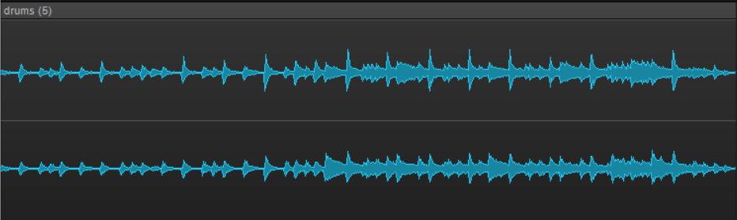
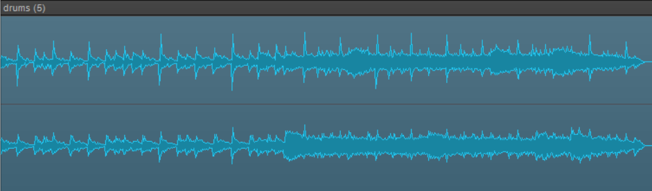
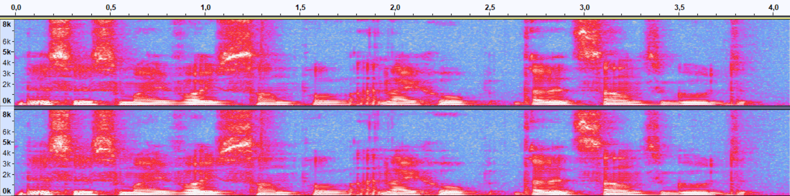
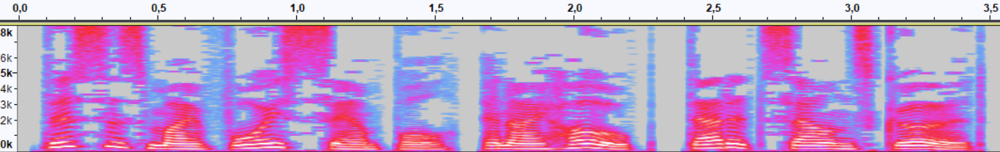
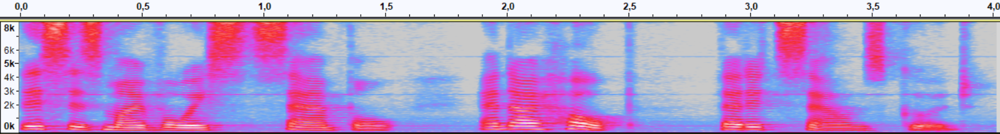
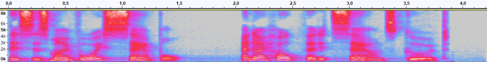

<h1 style="text-align: center;">

Jakub Ostrzołek

<!-- TODO: tytuł -->

WMM - lab. 3 - dźwięk

</h1>

# Część A - Cakewalk
## Zadanie 1
Przy oryginalnym filtrze dźwięk gitary był mocniejszy i bardziej pełny. Po zadanej filtracji, tak jak napisano w instrukcji, stał się lżejszy i bardziej "dzwoniący". Wynika to z faktu, że zostały wycięte niskie tony (stąd dźwięk mniej pełny), a podbite tony wysokie (stąd mocniejsze "dzwonienie").

## Zadanie 2
### Pogłos
#### Lektor
Głos lektora przy splocie z odpowiedzią impulsową "Vocal room" 40% jest wyraźny i brzmi naturalnie. Natomiast przy splocie z odpowiedzią impulsową "Big vocal hall" 80% głos jest trudno zrozumiały, a efekt echa jest tak mocny, że aż brzmi nienaturalnie.

Spadek w poziomie wyraźności mowy jest spowodowany nakładaniem się w danym momencie próbek pochodzących z poprzednich momentów, przez co głos brzmi "rozmycie" i trudno zidentyfikować poszczególne fonemy. Jak nazwa wskazuje, odpowiedź impulsowa "Big vocal hall" została z pewnością nagrana w większym pomieszczeniu niż "Vocal room", a więc efekt echa musiał tam być mocniejszy i dłuższy. Oprócz tego zwiększenie DRY/WET dwukrotnie również spotęgowało zaobserwowany efekt, ponieważ waga przy sumowaniu wersji z pogłosem w stosunku do oryginału była większa.

#### Chór
Nagranie chóru brzmiało dla mnie "kościelnie", dlatego wybrałem odpowiedź impulsową "Hall/Cathedral", a DRY/WET ustawiłem na ok. 30%.

Po dodaniu pogłosu, chór brzmiał pełniej i jeszcze bardziej "kościelnie". Odniosłem wrażenie, jakby składał się z większej liczby osób niż w oryginale. Wrażenie to może wynikać z faktu, że naturalnie im większy chór, tym trudniej idealnie się zsynchronizować. Dlatego po wprowadzeniu pogłosu, który rozmywa każdy dźwięk w czasie, występuje omawiany efekt.

### Kompresja dynamiki
Orygninał  

Freezed  

Jak słychać i widać na wykresie sygnału, po użyciu kompresora pierwsza połowa nagrania została bardziej wzmocniona niż druga. Oprócz tego chwile między uderzeniami w talerze w drugiej części nagrania zostały bardziej wzmocnione niż same uderzenia w talerze.

Zadaniem kompresora jest tłumienie głośniejszych sygnałów, a zatem w wyniku jego działania zmniejsza się różnica natężenia dźwięku między cichymi a głośnymi momentami w nagraniu. Oprócz tego make-up został tak dobrany, żeby kompresor zamiast po prostu ściszać głośne sygnały, to efektywnie wzmacniał ciche sygnały, a głośne zostawiał praktycznie nienaruszone. Stąd wynikają zaobserwowane efekty.

Efekt ten jest przydatny np. w branży reklamy telewizyjnej. Z oczywistych powodów twórcy reklam chcą odtwarzać swoje reklamy jak najgłośniej, jednak nie mogą przekroczyć pewnego limitu natężenia dźwięku narzuconego ustawowo. Jeżeli po prostu wzmocniliby nagranie, to nie wykorzystaliby limitu natężenia dźwięku przez cały czas trwania reklamy, ponieważ naturalnie w nagraniu występują chwile cichsze i głośniejsze. Dlatego przed wzmocnieniem, nagranie przepuszczane jest przez kompresor, aby wyrównać głośności w całym nagraniu i maksymalnie wykorzystać limity natężenia dźwięku.

## Zadanie 3
Kierunek dźwięku w płaszczyźnie azymutu jest głównie wyznaczany na podstawie różnicy w czasie pomiędzy sygnałem odbieranym z prawego ucha, a sygnałem odbieranym z ucha lewego.

Jednak sam ten efekt nie wystarcza do dokładnej lokalizacji źródła dźwięku, ponieważ jedna wartość różnicy w czasie na tych dwóch kanałach określa 2 półproste, z których może dochodzić dźwięk, a nie 1. Dlatego człowiek wspomaga się drugim mechanizmem - zmienną charakterystyką wrażliwości ucha na dane częstotliwości w zależności od położenia jego źródła (np. dźwięki dochodzące bezpośrednio z tyłu będą miały bardziej przytłumione wysokie tony niż te, dochodzące z przodu). Dokładny przebieg tej charakterystyki jest zmienny dla każdego człowieka i zależy m.in. od kształtu uszu.

Drugi mechanizm jest również wykorzystywany przy namierzaniu źródła dźwięku w płaszczyźnie elewacji i jest to jedyny mechanizm działający w tej płaszczyźnie.

Z powyższych zależności wynika, że najłatwiej będzie rozpoznać, czy dźwięk dochodzi z prawej czy z lewej strony, trochę trudniej czy dźwięk dochodzi z przodu czy z tyłu, a najtrudniej będzie określić kąt elewacji źródła dźwięku. Moje obserwacje potwierdzają te zależności.

Na trudność w lokalizacji dźwięku wpływa też fakt, że, jak wcześniej wspomniałem, każdy posiada inną charakterystykę wrażliwości na konkretne częstotliwości w zależności od kierunku dochodzenia dźwięku. A zatem nie istnieje model symulacji tego wrażenia, który sprawdzałby się idealnie dla wszystkich. W rzeczywistości wykorzystuje się uśrednione modele, opracowane po zmierzeniu tej charekterystyki wielu osobom.

## Zadanie 4
### Ścieżka 1
* OSC1/OSC2

	Kanał OSC1 daje niższy ton niż kanał OSC2. Na obu kanałach da się usłyszeć charakterystyczną, agresywną barwę fali kwadratowej. Złączenie obu kanałów daje dużo bardziej interesujący i mniej agresywny dźwięk niż każdy z kanałów osobno.
* Obwiednia

	Obwiednia kontroluje zachowanie filtra w czasie - im wyżej jest punkt na obwiedni tym więcej wyższych tonów słychać w danym momencie i vice versa. Dla każdego granego dźwięku przebieg jest odtwarzany od nowa oraz jest on zapętlony.
### Ścieżka 2
Tutaj słychać łagodniejsze od fal kwadratowych fale typu sawtooth, a przebieg czasowy charakterystyki filtra jest dużo wolniejszy. Zastosowałem preset "ARP 2050 Punk TAL", który zgodnie z nazwą dodaje pankowego klimatu do syntezatora.

Podobało mi się takie brzmienie, więc zamiast zmieniać melodię tej ścieżki, to dodalem nową ścieżkę (5) wraz z instrumentem oraz nową melodią.

### Ścieżka 3
Na tę ścieżkę wybrałem preset "BS Bass Deep TAL".

Wzmacniacz:
* Za pomocą pokrętła GAIN ustalany jest poziom natężenia dźwięku wchodzącego do wzmacniacza. Jego zmiana wpływa na barwę brzmienia dźwięku, ale nie moduluje bezpośrednio natężenia dźwięku wychodzącego ze wzmacniacza.
* Pokrętło DRIVE reguluje poziom przesteru. Ustawienie tego pokrętła w pozycję minimalną daje nam czysty dźwięk basu z syntezatora, a podkręcanie go sprawia że brzmienie jest coraz bardziej agresywne, robotyczne (coraz bardziej przypominające falę kwadratową).
* Pokrętła BASS, MID i TREBLE pozwalają regulować poziom odpowiednio niskich, średnich i wysokich tonów.
* Pokrętło TONE zmienia barwę dźwięku. Tym mocniejsze jest wycinanie wysokich tonów, im bliżej pokrętło jest wartości 0%.
* Pokrętło VOLUME reguluje poziom natężenia dźwięku wychodzącego ze wzmacniacza bez zmiany jego barwy (oczywiście dopóki sygnał na wyjściu nie staje się przesterowany).

### Ścieżka 4
Na tę ścieżkę wybrałem preset "Nice Studio Kit", ponieważ brzmi on dosyć surowo w porównaniu z innymi presetami, co pasuje do piosenki.

Do ścieżki dodałem m.in. tomy zaraz przed połową utworu oraz talerze w niektórych miejscach.

Kompresor:
* Kręcąc pokrętłem COMPRESS w lewo zmniejszamy poziom kompresji głośnych dźwięków, a w prawo zwiększamy.
* Suwak TIME CONSTANTS pozwala ustalić, czy kompresor będzie szybko reagował na zmiany głośności, czy wolno. Jego działanie widać po prędkości wskazówki (szczególnie przy pierwszym werblu - po dźwięku werbla, gdy suwak jest w pozycji FAST, wskazówka szyciej wraca na pozycję 0, niż gdy suwak jest w pozycji SLOW).
* Pokrętłem MAKE-UP regulujemy wzmocnienie na wyjściu z kompresora.

Uznałem, że do piosenki pasuje mocna kompresja perkusji, dlatego ustawiłem pokrętło COMPRESS na ok. 36, MAKE-UP na 24, a TIME CONSTANTS na FAST.

# Część B - TTS, STT
## Zadanie 1
### Real-Time Voice Cloning (plik `tts-clone.wav`)
Do tego syntezatora była potrzebna próbka mojego głosu (plik `record_en.wav`).

Syntezator starał się naśladować mój głos, jednak wygenerowana próbka różni się dosyć znacząco od mojego oryginalnego nagrania. Oprócz tego, że barwa głosu nie została w pełni wiernie oddana, to słychać również różnicę w dynamice wypowiedzi, np. w długości przerw między słowami i melodii mowy. Ponadto, na ścieżce dźwiękowej słychać czasami artefakty, tłumiące na chwilę dźwięk. Przypadłości te mogą częściowo wynikać z małej długości próbki mojego głosu (zaledwie kilka sekund) i niskiej jakości mikrofonu użytego do nagrania.

Pomimo wyżej wymienionych wad, głos jest wyraźny i nie brzmi całkowicie syntetycznie, jednak da się rozpoznać, że raczej nie jest to głos prawdziwej osoby.

### Google TTS (plik `tts-google.wav`)
Ten syntezator daje najbardziej sztucznie brzmiące nagrania. Bardzo łatwo jest je odróżnić od prawdziwego, ludzkiego głosu.

Natomiast nagranie jest z pewnością wyraźne. Mam wrażenie, że czasami nawet do przesady wyraźne, np. końcówki wyrazów w prawdziwej mowie często artykułowane są ciszej i bardziej niedbale, czego nie słychać w głosie tego syntezatora.

### Tacotron2 + Waveglow (plik `tts-waveglow.wav`)
Ten syntezator generuje całkiem wiarygodny głos, zarówno pod względem barwy, jak i, co ważniejsze, dynamiki. Głos brzmi na tyle naturalnie, że byłbym w stanie uwierzyć, że został on nagrany przez prawdziwego człowieka.

Przez cały czas trwania słychać dosyć wysoki ton, co obniża jego jakość, ale nie umniejsza jego naturalności. Ton prawdopodobnie pochodzi ze zbioru danych uczących i został on wyuczony przez model. 

### Mozilla TTS (plik `tts-mozilla.wav`)
Ten syntezator daje według mnie najlepsze efekty. Nie dość, że głos brzmi bardzo naturalnie, to jakość jest lepsza, niż w przypadku Waveglow TTS (m.in. dlatego, że nie ma tutaj wspomnianych wyżej wysokich tonów). Nie mam żadnych zarzutów do tego syntezatora.

### Podsumowanie
Uszeregowane syntezatory według malejącej wiarygodności: Mozilla, Waveglow, Voice Cloning, Google.
Uszeregowane syntezatory według malejącej jakości i wyraźności: Mozilla, Waveglow, Google, Voice Cloning.

## Zadanie 2
Nagranie  

Google TTS  

Tacotron2 + Waveglow  

Mozilla TTS  

### Nagranie (plik `record_en.wav`)
Jako jedyne jest dwukanałowe, a zatem żaden z syntezatorów nie produkuje dźwięku stereo. Również jako jedyne ma częstotliwość próbkowania równą 44 100 Hz, gdzie reszta ma tę częstotliwość w okolicach 22 000 Hz.

Na spektrogramie widać dużo szumów, ponieważ było ono stworzone niskiej jakości mikrofonem.

W porównaniu z innymi spektrogramami, na tym nie widać wyraźnie oddzielonych od siebie tonów harmonicznych. Może to wynikać z kilku faktów, takich jak niższy ton głosu (wszystkie syntezatory miały głos żeński, a ja męski), czy słaba jakość mikrofonu.

### Google TTS (plik `tts-2-google.wav`)
Ze spektrogramu również można odczytać, że ten syntezator produkuje najbardziej sztucznie brzmiący głos. Wskazują na to takie właściwości jak:
* podczas mówienia nie ma żadnych szumów, a jedynie zsyntezowany głos,
* między dźwiękami jest całkowita cisza, tu również nie ma tam żadnych szumów,
* głos bardzo ostro oddziela się od od tła, np. ostro się zaczyna i kończy, widać praktycznie tylko czyste, "płaskie" częstotliwości.

### Tacotron2 + Waveglow (plik `tts-2-waveglow.wav`)
Tutaj spektrogram dużo bardziej przypomina spektrogram mojego nagrania. Dźwięki nie są tak bardzo ostre jak w przypadku Google TTS i przez cały czas jest jakiś szum tła. Jest to głos żeński, dlatego harmoniczne sięgają wyżej niż w moim nagraniu.

Bardzo dobrze widać tutaj wysoki ton, o którym wspominałem przy zadaniu 1. W zasadzie widać nawet 3 tony: w okolicach 500 Hz, 3000 Hz i 5500 Hz, które ciągną się przez całą długość nagrania.
### Mozilla TTS (plik `tts-2-mozilla.wav`)
Spektrogram bardzo podobny do poprzedniego. Różnice, jakie widać gołym okiem, to trochę mniejsza ilość szumów i brak ciągłych tonów opisanych wyżej.

## Zadanie 3
### Nagranie
Nagrenie użyte do STT znajduje się w spliku `record_en.wav`. Jego prawdziwa treść brzmi:
*This is my voice sample and I hope that it sound good.*
### CMUSphinx
*this is my voice phone call and i hope both sides moved to*
### Google
*this is my voice sample and I hope that it sounds good*
### Moilla
*this is my vice sample and i hope that it sounds good*

### Komentarz
Algorytm Google poradził sobie bezbłędnie, co nie powinno dziwić, ponieważ firma ta mocno rozwija dziedzinę STT.

Algorytm Mozilli pomylił jedno słowo: "voice" na "vice", a zatem różniące się tylko jedną literą. Również bardzo dobry wynik.

CMUSphinx poprawnie rozpoznał ok. 50% tekstu. Widać, że próbował użyć często wykorzystywanego wzorca: *voice phone call*, kiedy nie potrafił dokładnie określić moich słów.

