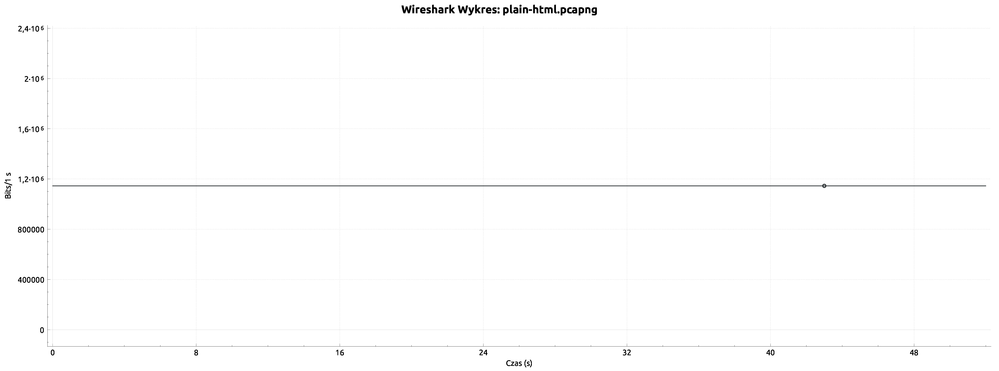

<h1 style="text-align: center;">

Jakub Ostrzołek

WMM - lab. 6 - strumieniowanie multimediów

</h1>

## Zadanie 1

> Jakie komunikaty protokołu HTTP zostały użyte podczas transmisji?

* `GET /video/download.html` - dokument HTML,
* `GET /favicon.ico` - nieistotna ikona,
* `GET /video/video/sintel-trailer-480_med.mp4` - właściwy plik wideo w formacie mp4, jest pobierany w kilku żądaniach HTTP i setkach pakietów TCP.

> Oszacować średnią i maksymalną przepływność strumienia danych podczas transmisji pliku multimedialnego.

* maksimum: ok. 50 Mb/s
  
* średnia: ok. 1,2 Mb/s
  

> Na podstawie analizy kodu źródłowego dokumentu HTML z pkt. 2 określić jakie elementy języka HTML5 zostały wykorzystane do odtworzenia pliku multimedialnego. Czy umożliwiają one odtwarzanie dowolnych formatów danych multimedialnych?

Został użyty tag `<video>` i `<source>`. Wspierane formaty danych multimedialnych są ograniczone i zależą od przeglądarki.

## Zadanie 2
> Jakie komunikaty protokołu HTTP zostały użyte podczas transmisji?

* `GET /video/dash.html` - dokument HTML,
* `GET /video/js/dash-2.0.all.min.js` - biblioteka umożliwiająca odtwarzanie formatu MPEG-DASH,
* `GET /video/video/sintel-trailer-480_dash/stream.mpd` - deskryptor MPEG-DASH,
* `GET /favicon.ico` - nieistotna ikona,
* `GET /video/video/sintel-trailer-480_dash/video/{1 lub 3}/init.mp4` - plik w formacie mp4, zawierający nagłówek strumienia wideo (najpierw ściągane były pliki reprezentacji 1, potem 3),
* `GET /video/video/sintel-trailer-480_dash/audio/und/init.mp4` - plik w formacie mp4, zawierający nagłówek strumienia audio,
* `GET /video/video/sintel-trailer-480_dash/video/{1 lub 3}/seg-{n}.m4s` - kolejne fragmenty strumienia wideo w osobnych plikach w formacie mp4 bez nagłówka - m4s (najpierw ściągane były pliki reprezentacji 1, potem 3),
* `GET /video/video/sintel-trailer-480_dash/audio/und/seg-{n}.m4s` - kolejne fragmenty strumienia audio w osobnych plikach w formacie mp4 bez nagłówka - m4s.

> Oszacować średnią i maksymalną przepływność strumienia danych podczas transmisji pliku multimedialnego.

* maksimum: ok. 54 Mb/s
  
* średnia: ok. 1,8 Mb/s
  

> Odczytać deskryptor danych multimedialnych (MPD), na jego podstawie określić format danych multimedialnych, liczbę reprezentacji i segmentów.

* format danych multimedialnych: mp4
* liczba reprezentacji: 3 wideo, 1 audio
* liczba segmentów: $ceil(52.208/2.019) = 26$

## Podsumowanie
> Na podstawie uzyskanych wyników porównaj analizowane metody strumieniowania danych multimedialnych, określ możliwości ich zastosowania do dystrybucji programów telewizyjnych.

czyste HTTP | MPEG-DASH
-|-
używa HTTP | używa HTTP
jeden plik przesyłany w całości | plik podzielony na wiele fragmentów przesyłanych osobno
brak dodatkowych deskryptorów | desktyptor opisujący fragmenty pliku bazowego
brak możliwości adaptacji przepływności bitowej do łącza sieciowego | możliwość adaptacji przepływności bitowej do łącza sieciowego
nie nadaje się do dystrybucji programów telewizyjnych, bo nie jest adaptowalny do warunków sieciowych | nadaje się do dystrybucji programów telewizyjnych, bo jest adaptowalny do warunków sieciowych