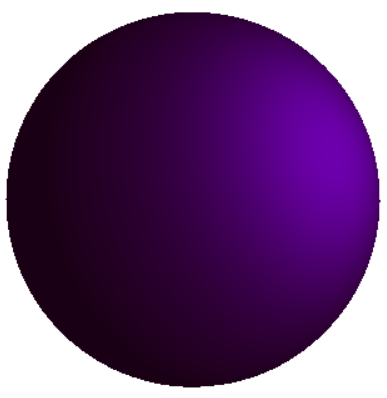
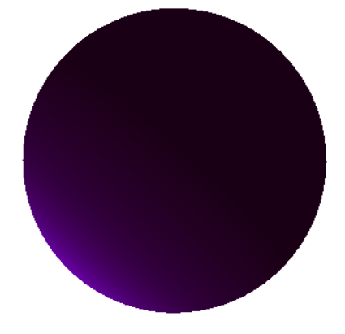
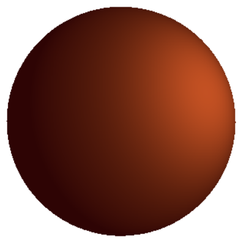
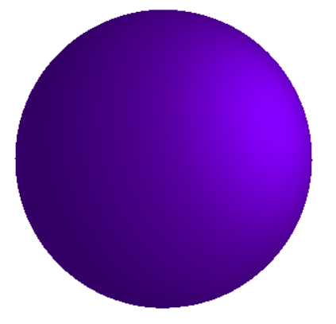
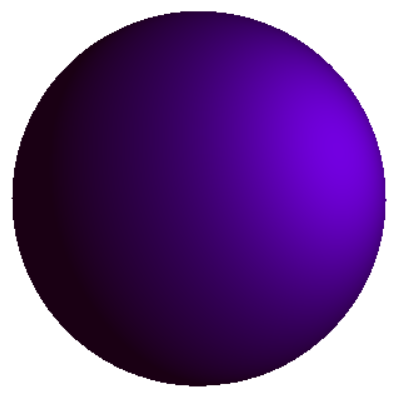
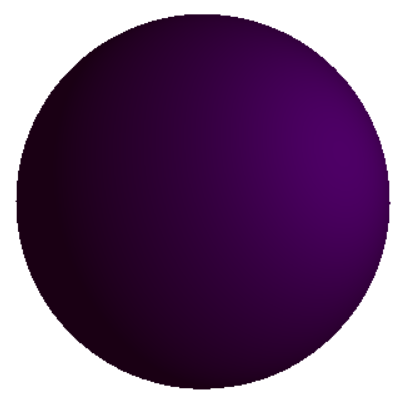
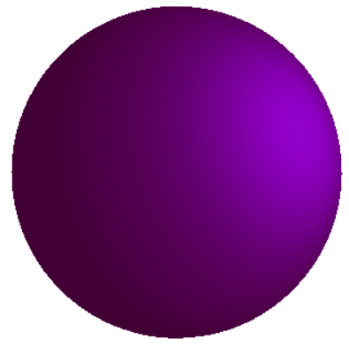
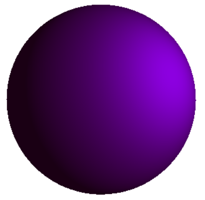
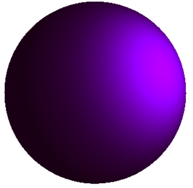
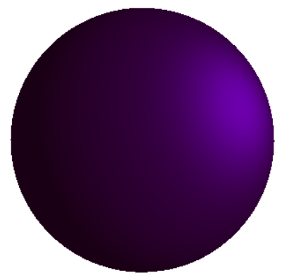

<h1 style="text-align: center;">

Jakub Ostrzołek

WMM - lab. 8 - Generowanie grafiki

</h1>

## Składanie transformacji (robot)
To zadanie zostało przeze mnie wykonane w ramach stacjonarnych laboratoriów.

## Cieniowanie
Tak jak wskazano w instrukcji, w programi dostępne są następujące parametry:
* w shaderze (`phong.frag`):
  * `light_position` - pozycja źródła światła
  * `ambient_light_color` - kolor światła otoczenia
  * `ambient_strength` - współczynnik otoczenia
  * `diffuse_strength` - współczynnik rozproszenia
  * `specular_strength` - współczynnik odbicia
* w programie (`phong_window.py:init_shaders_variables`):
  * `obj_color` - kolor obiektu
  * `diffuse_light_color` - kolor światła rozproszenia
  * `specular_light_color` - kolor światła odbicia
  * `shininess` - współczynnik połyskiwości

Poniżej przedstawiono wpływ tych ustawień na renderowaną grafikę.
* początkowe ustwienia  

* zmiana kierunku światła  

* zmiana koloru obiektu  

* zmiana koloru światła otoczenia  

* zmiana koloru rozproszenia światła  

* zmiana koloru odbicia światła  

* zmiana współczynnika otoczenia  

* zmiana współczynnika rozproszenia  

* zmiana współczynnika odbicia  

* zmiana współczynnika połyskliwości  

